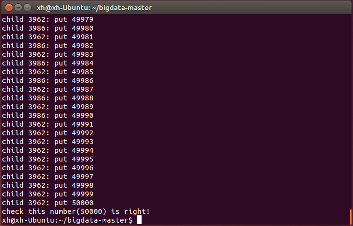
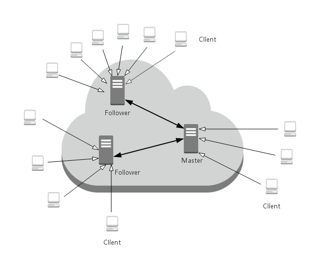

# 实践项目 1：一个支持分布式锁的简单Consensus系统设计 #

----------

### 运行和结果验证 ###
- 运行：`./do.sh -c 50 -n 1000` 
- 结果：如下图所示 
 
- 解释： 
	- `-c 50`代表开启50个客户端。（不能超过100个）
	- `n 1000`代表每个客户端要完成的操作数。
	- 每个客户端要取得锁来完成对本地`teat.txt`的一次操作。每次都取得文件中的数然后加一。即整个过程中文件将被互斥地操作`c*n`次（`c`个客户端，每个客户端完成`n`次操作）。
	- 控制台输出每次操作由哪个线程完成，并且是第多少次操作。
	- 最后如果完成时文件中的数字满足要求将会打印一个验证正确的结果。

### 系统设计 ###
 
1.	默认是3个服务端线程。`server 0`即Master服务端。每当有新的客户端加入时采用轮转的方式为其分配服务端，且不再改变。 
2.	全部采用消息队列的方式通信。 
3.	客户端可以向对应的服务端发送查询、要求锁，释放锁三种消息类型。 
4.	如果是Fellow服务端接受要求锁，释放锁的消息，将转发给Master。相应的有了来自Master的回应将转发给相应的客户端。 
5.	所有关于锁的记录和分配决策由Master负责，每次有更新将向Follower推送更新。 
