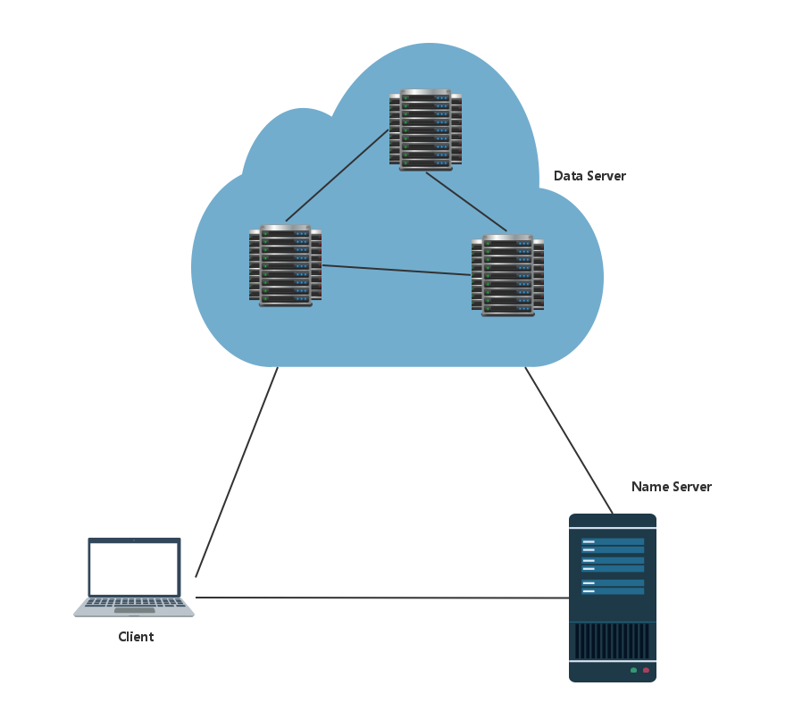

###required
 `sudo apt-get install libboost-dev libboost-system-dev pkg-config libprotobuf-dev protobuf-compiler libssl-dev`

###compile *.poto
`protoc message.proto --cpp_out=.`

### test
`make`
 

 `./dfs [filename]` 
进行一次完整的测试。上传文件，下载文件并完成比较。 

`./upload [filename]` 
上传文件。 

`./read id [filename]` 
下载文件。（`id`为上传文件成功时打印在控制台的数字id。） 

##系统设计 
 

- Client 
1.客户端根据待上传的文件大小和参数设置，对文件进行分段。向Name Server发起连接，逐段向Name Server询问目的Data Server的IP地址和端口。 
2.根据Name Server返回的对应块的上传目的Data Server的IP地址和端口，发起连接，将数据段上传。 
3.根据文件名和文件ID（由Name Server返回）向Name Server查询数据段的存放记录，得到目的Data Server的IP地址和端口。 
4.根据Name Server返回的对应块的存放的Data Server的IP地址和端口，发起连接，将数据段下载，最后拼接成指定文件。 

- Name Server 
1.接受Data Server的注册信息，保存当前网络的Data Server在线状况。并将Data Server的当前状况发生的改变返回给需要知情的Data Server。（每个Data Server需要知道与自己相邻的两台Data Server的IP地址和端口。） 
2.接受来自Client的查询，如果某文件首次上传，则分配id。如果数据段无存储记录，则按轮转的方式分配一台Data Server并记录此对应关系，并返回相关信息。如果已有相关记录， 则直接返回相关信息。

- Data Server 
1.在刚刚启动时向Name Server发起连接并注册，告知自己的相关信息。并保持连接，等待接收来自Name Server的更新信息。保持自己能够连接到两台相邻的主机。 
2.等待来自Client或者相邻的Data Server的连接，判断是要存储数据还是获取数据。如果是获取数据，则直接在本地查找并返回数据。如果是存储数据，则按规则将数据在本地存储，并且如果是来自Client的存储数据，还要向相邻的两台Data Server转发数据以备份。如果是来自Data Server则不转发数据，只作存储。