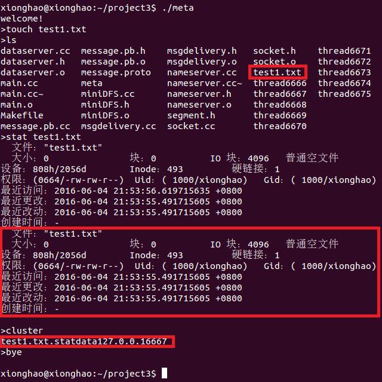

###成员
**第一小组：**
熊浩，王振杰，伍明利，孙梦璇，徐天宇，林晨

###required
 `sudo apt-get install libboost-dev libboost-system-dev pkg-config libprotobuf-dev protobuf-compiler libssl-dev`

###compile *.poto
`protoc message.proto --cpp_out=.`

### test
`make`
 

 `./meta` 
启动，进入测试。如图。 
 
- "weicome"即提示客户端启动。 
- 新建一个"test.txt"文件 
- `stat`指令可以查看这个文件的数据。第一次显示是从本地文件系统的得到的文件元数据。第二部分显示的则是从服务器上获得的这个文件的元数据，可以检查发现完全一致。 
- `cluster`命令可以查看服务端的元数据分布情况。可以看到文件名和其元数据存储对应的dataserver的IP和端口号。 
- "bye"可以退出程序，完成测试。 

##系统设计 
 
由一个 NameServer 管理 Client 文件和其元数据存储的 DataServer 的对应关系。
DataServer 采用主从备份，没份数据共有3个副本。具体情况如下：

- Client 
1.客户端方面进行的会更改元数据的操作时，则向Name Server发起连接，询问Name Server分配的目的Data Server的IP地址和端口。 
2.根据Name Server返回的上传目的Data Server的IP地址和端口，向Data Server发起连接，将新的元数据上传更新。 
3.根据文件名向Name Server查询元数据的存放记录，得到目的Data Server的IP地址和端口。 
4.根据Name Server返回的对应元数据的存放的Data Server的IP地址和端口，发起连接，将元数据下载，显示在客户端。 

- Name Server 
1.接受Data Server的注册信息，保存当前网络的Data Server在线状况。并将Data Server的当前状况发生的改变返回给需要知情的Data Server。（每个Data Server需要知道与自己相邻的两台Data Server的IP地址和端口。） 
2.接受来自Client的查询，如果该文件无存储记录，则按轮转的方式分配一台Data Server并记录此对应关系，并返回相关信息。如果已有相关记录， 则直接返回相关信息已满足查询。

- Data Server 
1.在刚刚启动时向Name Server发起连接并注册，告知自己的相关信息。并保持连接，等待接收来自Name Server的更新信息。保持自己能够连接到两台相邻的主机。 
2.等待来自Client或者相邻的Data Server的连接，判断是要存储数据还是获取数据。如果是获取数据，则直接在本地查找并返回数据。如果是存储数据，则按规则将数据在本地存储，并且如果是来自Client的存储数据，还要向相邻的两台Data Server转发数据以备份。如果是来自Data Server则不转发数据，只作存储。